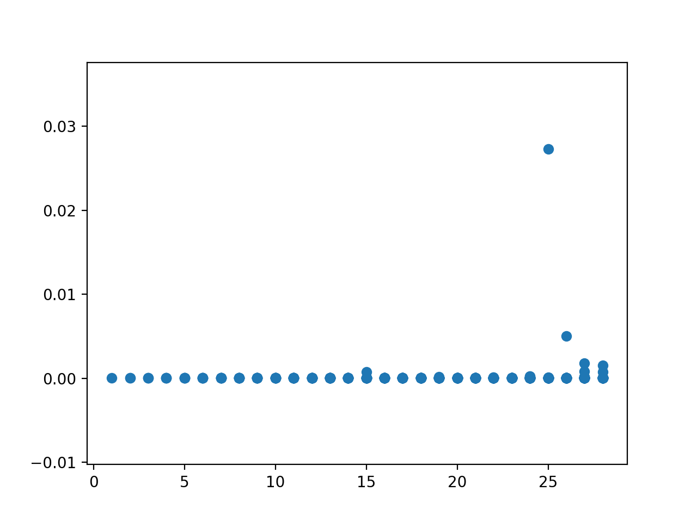
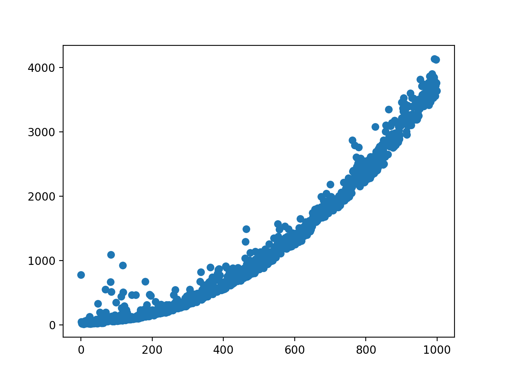

# Memoria de la práctica de Algoritmica y Complejidad
### Autores: Jordi Rafael Lazo Florensa, Alejandro Clavera Poza, Sergi Puigpinós Palau, José Ramón Noguero de Llano

## Índice 
1. Introducción
2. Módulo Preprocesamiento
3. Módulo Alineamiento
4. Módulo Clustering
5. Ejecución del programa

## 1. Introducción 
El objetivo de esta práctica es, dada una lista de muestras del SARS-CoV-2 de diferentes paises, agrupar estas según su similitud.

A lo largo de este documento, se irán comentando y analizando los costes de los principales algoritmos implementados en los diferentes módulos de la práctica.

La práctica ha sido dividida en los siguientes módulos:
1. Preprocesamiento
2. Alineamiento (alineamiento de secuencias)
3. Clustering (clasificación)

## 2. Módulo Preprocesamiento
La función de este módulo es leer una lista de muestras de un fichero csv y obtener la muestra mediana de cada pais.

Para realizar esta operación, se han implementado principalmente las siguientes funciones:

* **load_regions**: Esta función lee el fichero de las muestras y obtiene los diferentes paises en forma de un diccionario, donde cada clave es una pais.
* **load_samples_of_csv**: La tarea de esta función es la de obtener las muestras de cada pais, al igual que la función anterior, devuelve un diccionario donde cada clave en un pais y el valor son las muestras del pais.
* **median**: Esta función calcula la muestra de longitud mediana de una lista.
* **get_median_samples_of_csv**: El objetivo de esta función es obtener la muestra mediana de cada pais leido del csv.

La función load_regions, ha sido implementada para mejorar el coste computacional de la función load_samples_of_csv. Como se ha nombrado anteriormente, se ha decidido que las muestras estarán estructuradas en un diccionario con todos los paises y cada pais tendrá un subdiccionario con sus muestras. Para hacer esto, antes de añadir una muestra a cada pais, se ha de estar seguro que el subdicionario esta creado, el hecho de implementar load_regions nos permite olvidarnos de eso ya que en el momento que lee los paises esta ya crea los subdiccionarios. De este modo obtenemos un coste en el peor de los casos de n * max(m), siendo n el número de paises y m el número de muestras de cada pais.

Otra forma de implementarlo seria comprobando si antes se ha leído una muestra del país, si no es así primero se crea el subdiccionario y a continuación se añade la muestra. Aunque esta solución no es tan eficiente como la anterior porque se esta buscando si el país ya esta en el diccionario. Por lo tanto, su coste sería de n ^ 2  max(m) frente a n  max(m).

La función median es la encargada de calcular la mediana de una lista de muestras, para implementar este algoritmo, utilizamos el algoritmo quicksort para ordenar las muestras. Una vez ordenada, la lista se podrá encontrar la mediana en la posición central de la lista. Cabe resaltar que, si la lista a calcular es de longitud par, la mediana quedará entre dos valores, en ese caso se ha de calcular la media de ambos, como no existe una muestra con ese valor se opta por escoger el valor mayor de ambos.

El coste de implementar este algoritmo es:
```
n log(n)
```

Este coste se obtiene gracias a la implementación del quicksort, pese a que en los peores casos el coste de este puede llegar a aumentar a n ^ 2, de promedio siempre es n log(n).



Como se puede observar en este gráfico, el coste experiemental, es prácticamente n log(n) a excepción de puntos aislados los cuales el coste ha sido n ^ 2.

## 3. Módulo Alineamiento
La tarea principal de este módulo, es obtener el alineamiento óptimo de cada secuencia con todas la demás.

Las principales funciones que encontramos en este módulo son:
* **calc_needleman_score**: Función encargada de obtener la alineación óptima de dos secuencias, para esto se utiliza el algoritmo de Needleman–Wunsch.
* **get_scores**: Esta función se encarga de alinear cada secuencia con todas la demás.

### 3.1 calc_needleman_score
Para implementar esta función cabe destacar el uso del lenguaje C, ya que el tiempo y coste de ejecución de este algoritmo en python es muy elevado.

El algoritmo calcula las puntuaciones de la primera columna y de la primera fila de la matriz, lo cual tiene un coste de m + n + 2, ya que la matriz es de tamaño (m + 1) * (n + 1). 

Una vez calculada la primera fila y la primera columna, se calcula las m * n puntuaciones restantes.

El pseudocódigo de este algoritmo es:

```
for i=0 to length(A)-1:
     M(i,0) = d*i
for j=0 to length(B)-1:
     M(0,j) = d*j
for i=1 to length(A):
    for j = 1 to length(B):
       Choice1 = M(i-1,j-1) + S(A(i), B(j))
       Choice2 = M(i-1, j) + d
       Choice3 = M(i, j-1) + d
       M(i,j) = max(Choice1, Choice2, Choice3)
     
```

Con toda la información comentada anteriormente podemos llegar a la conclusión de que el coste es:
```
(m * n) + m + n + 2
```
Cabe destacar la forma de implementación de este algoritmo, ya que esta relacionado con la puntuación, es decir, a mayor puntuación tenga el alineamiento mayor similitud tendrá con las otras secuencias.



Para obtener el coste experimental, se ha probado con secuencias de n nucleidos, por tanto, la imagen ha de describir el coste de n ^ 2 + 2n + 2, aunque si bien es cierto que la imagen describe una función exponencial debido ha que a sido alterada por operaciones externas como por ejemplo el paso a ejecutar el código en C, lo que conlleva un aumento del coste experimental debido a la preparación de los datos.

### 3.2 get_scores
Esta función se encarga de realizar el alineamiento de todas las cadenas ARN. 

Para realizar esta operación se utiliza una matriz de x  x elementos donde x es el número de secuencias ARN, en cada posición de la matriz se calculará el alineamiento óptimo, donde los índices representan las muestras.

A la hora de calcular los alineamientos de esta matriz, al tratarse de una matriz simétrica, solo es necesario calcular la parte superior de la diagonal y mientras se va calculando cada posición se copia el mismo valor en la parte inferior de la diagional.

De esta forma cada vez que se desplaza una fila se calculará una puntuación menos que la fila anterior, obteniendo asi que el número de alineaciones es de (x * (x-1)/2), por tanto se reduce a la mitad el coste teórico respecto a la operación de recorrer la matriz entera.

Como el coste de cada alienación es de m * n + m + n + 2, podemos llegar a la conclusión que el coste del algoritmo es: 

```
(x * (x-1)/2) * (m * n + m + n + 2)
```

## 4. Módulo Clustering
Este módulo se encarga de agrupar las muestras obtenidas en función de su similitud, para esto se implementa las siguientes funciones:

* **group_up**: Esta función agrupa cada muestra en el grupo en el cual se encuentre más cerca de su centro, esta función tiene un coste de n*k donde n es el número de elementos y k el número de grupos.

* **calc_next_centers**: Función es la encargada de calcular el centro de cada cluster.

* **compare_clusters**: Esta función compara si dos grupos de cluster son iguales. El coste de este algoritmo es n ya que las muestras estan distribuidas en cada cluster el número de comparaciones que va realizar es n.

* **k_medoids**: Función encargada de agrupar las muestras según su similitud.


### 4.1 group_up
Esta función asigna cada muestra en el cluster cuyo medoid es más similar a él. Cada punto irá para el cluster donde la alineación con su medoid tenga la puntación mayor.

Como el algoritmo ha de calcular a que cluster pertenece cada muestra el coste será de:
```
n * k
```
k representa el número de clusters.

### 4.2 calc_next_centers
Esta función calcula los nuevos centros de los clusters, esta operación se realiza buscando la muestra que tenga más similitud con el resto de muestras del cluster, es decir, la que tenga mayor puntuación en el alineamiento con cada muestra del cluster.

El pseudocódigo del agoritmo implementado es el siguiente:

```
centers = []
for cluster in clusters:
     best_center = 0
     best_center_score = 0
     for i in cluster:
          sum_score = 0
          for j in cluster:
               if j != i:
                    sum_score = sum_score + scores[i][j]
          if best_center_score < sum_score:
               best_center = i
               best_center_score = sum_score
     centers.append(best_center)
```
Para obtener el coste de este algoritmo, se ha tenido en cuenta que el peor caso ocurre cuando todas las muestras se encuentran en un solo cluster a excepción de los medoids, en ese caso la función ha de comparar cada muestra con todas otras muestras a exepción de los medoids de los clusters restantes.

Teniendo en cuenta lo anterior se puede llegar a la conclusión que el coste de implementar este algoritmo es:
```
(n - k + 1) ^ 2 + k  - 1
```

### 4.3 compare_clusters
Esta función compara si dos listas de medoids son iguales. Para esto compara si cada medoid de cada cluster contenga las mismas muestras que el otro.

Puesto que el algoritmo ha de realizar tantas comparaciones como elementos que hay en cada cluster y que cada muestra esta contenida en un cluster podemos llegar a la conclusión que el coste de implementación de este algoritmo es de:
```
n
```

### 4.4 k_medoids
Dada una lista de muestras y su matriz de puntuaciones esta función agrupa las muestras según su distancia. Un medoid es el punto más ubicado hacia del centro de un grupo.
Para ello se selecciona una muestra del grupo de los puntos como medoid. A continuación, se asocia cada punto al medoid más cercano, tras ello se vuelve a buscar un nuevo medoid. Para el caso de esta práctica se busca el que tenga la suma máxima ya que dadas dos muestras a mayor puntuación tienen más similares son.

El pseudocódigo de este algoritmo es:

```
centers = random_centers()
cluster = group_up_elements()
while cluster != last_cluster:
    last_cluster = cluster
    centers = select_new_centers()
    cluster = group_up_elements()
```
Como se supone que estará distribuido, el peor de los casos será que todas las muestras de un cluster hayan sido medoids, antes de finalizar el algoritmo. Por lo tanto, en el peor de los casos el bucle dará n / k vueltas.

El coste de este algoritmo es:
```
n/k * ((n*k-1)^2 + k-1 + k * n + n).
```

## 5. Ejecución del programa
Para ejecutar el programa primero se tiene que ejecutar el comando:
```
make
```
o
```
make all
```
Ya que se tiene que compilar parte de la práctica que esta hecha en C.

Por otro lado si se quiere realizar los test se utilizará el comando:
```
make test
```


